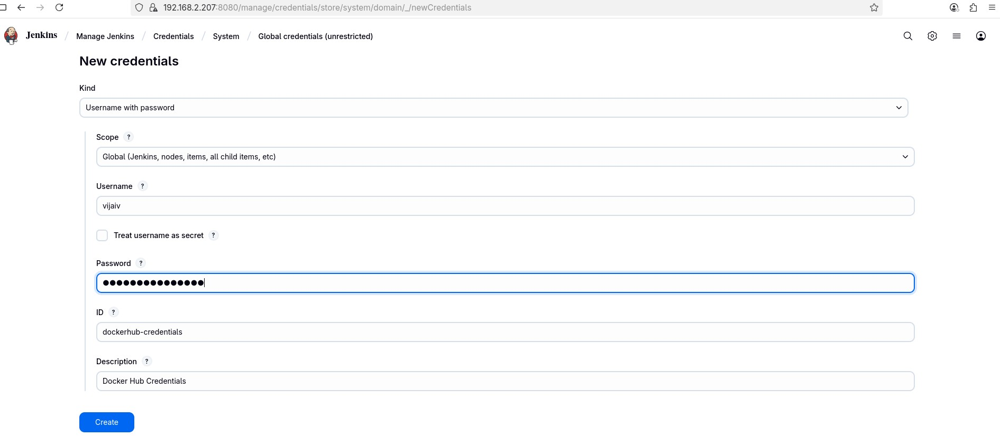

# Hello World Node.js Application

A simple "Hello, World!" application built with Node.js and Express. This project is containerized with Docker, includes deployment manifests for Kubernetes, and is configured for a CI/CD pipeline.

## Features

-   **API**: Simple HTTP server using Express.js with a health check endpoint.
-   **Testing**: Comprehensive test suite using Jest and Supertest, with code coverage reports.
-   **Development**: Local development with auto-reload via Nodemon.
-   **Containerization**:
    -   Optimized, multi-stage production `Dockerfile` using a non-root user for security.
    -   `Dockerfile.dev` for a consistent development and testing environment.
-   **Orchestration**: Production-ready Kubernetes deployment and service manifests with health checks and resource limits.
-   **CI/CD**: Ready for automation with tools like Jenkins or GitHub Actions for testing, building, and deploying.
-   **Code Quality**: Configured for integration with SonarQube.

## Prerequisites

-   Node.js (v18 or later)
-   Docker
-   kubectl (for Kubernetes deployment)

## Getting Started

### 1. Clone the Repository

```bash
git clone <repository-url>
cd hello-world-nodejs
```

### 2. Install Dependencies

```bash
npm install
```

### 3. Run the Application Locally

-   **Development Mode (with auto-reload):**
    ```bash
    npm run dev
    ```

-   **Production Mode:**
    ```bash
    npm start
    ```

The server will be available at `http://localhost:3000`.

### 4. Run Tests

```bash
# Run all tests once and generate coverage
npm test

# Run tests in watch mode
npm run test:watch
```

## Implement Jenkins Pipeline

Create jenkinsfile and create a pipepline 


## Configure OWASP Dependency check

Install the OWASP plugin in the Jenkins master and restart the jenkins master as part of it.


Enable OWASP on Jenkins masters tools configuration.


Create NVD (National Vulnerability Database) API Key and then use that on the OWASP dependency check.

File the form and then you'll receieve the API key over the email. Add that API secret into the Jenkins master configuration system and Find Global properties add in Environment Variables. 


Add: Name: NVD_API_KEY, Value: your-actual-api-key


Now, update the jenkinsfile to accomdate owasp dependency check

```
    stage('Dependency Scanning') {
        steps {
            echo 'Running OWASP Dependency Check..'
            // Use withCredentials to securely inject the NVD API key
            withCredentials([string(credentialsId: 'nvd-api-key', variable: 'NVD_API_TOKEN')]) {
                dependencyCheck(
                    additionalArguments: """
                        --scan .
                        --out .
                        --format ALL
                        --nvdApiKey '${NVD_API_TOKEN}'
                    """,
                    odcInstallation: 'OWASP-dependency-check-10'
                )
            }
        }
    }
```


## Integrate SonarQube into the Jenkins Pipeline

well, use this Github to quickly setup sonarqube docker-compose up and running in the Environment. 
https://github.com/vijai-veerapandian/sonarqube-setup 

then, Install sonarqube plugin inside Jenkins master.


Login into the Sonarqube and then create a local project and integrate it with Jenkins


Here is the line I have added on the Jenkinsfile related to sonarqube intergration into the jenkinsfile.

```
    stage('SAST - SonarQube') {
        steps {
            sh 'echo $SONAR_SCANNER_HOME'
            sh '''
                $SONAR_SCANNER_HOME/bin/sonar-scanner \
                  -Dsonar.host.url=http://192.168.2.206:9000 \
                  -Dsonar.token=sqp_fabd16be54526ef3c3be68c2a67186ceff4fa5ba \
                  -Dsonar.projectKey=hello-world-nodejs
            '''
        }
    }
```


Instead of adding SonarQube url and token directly, lets add it on Jenkins Credentials provider. So, it'll be mashed.


add the created SonarQube API token into the system configuration.


and also update the jenkins.groovy file to use sonarqube-server

```
    stage('SAST - SonarQube') {
        withSonarQubeEnv('sonarqube-server') { // Matches the name in "Manage Jenkins > Configure System"
            sh 'sonar-scanner'
        }
    }
```

#### Create, sonar-project.properties file, which makes sure Sonarqube points to "Hello world Node JS" project.

Lets re-run the pipeline.


### Sonar-Qube quick report


#### Implement Dockerization of the application and enable the Jenkins pipeline to do it.

1. Add Docker hub credentials into the Global credentials in the Jenkins master Manage jenkins setting.


#### Implement Trivy for vulnerability scanning.

1. Install Trivy on the Jenkins VM agent running which will be running the jobs.

```
sudo apt-get update
sudo apt-get install wget apt-transport-https gnupg lsb-release -y

wget -qO - https://aquasecurity.github.io/trivy-repo/deb/public.key | sudo gpg --dearmor -o /usr/share/keyrings/trivy.gpg


echo "deb [signed-by=/usr/share/keyrings/trivy.gpg] https://aquasecurity.github.io/trivy-repo/deb $(lsb_release -sc) main" | sudo tee /etc/apt/sources.list.d/trivy.list

sudo apt-get update
sudo apt-get install trivy -y

trivy --version
```


#### Implementing Docker

The project includes two Dockerfiles:
-   `Dockerfile`: For creating a lean, optimized production image.
-   `Dockerfile.dev`: For creating a development environment with all dependencies needed for testing.





#### Implement Build Docker Image and Trivy Vulnerability scanning and Push Docker Image on your jenkinsfile.groovy


#### Finally, producation ready Image is prepared and pushed into Docker hub


#### Integrate AKS 


#### Implement ArgoCD 


#### Test and Enable CD Continous Delivery 

#### Integrate Slack notification


### Build Images

-   **Production Image:**
    ```bash
    docker build -t hello-world-app .
    ```

-   **Development Image:**
    ```bash
    docker build -f Dockerfile.dev -t hello-world-app:dev .
    ```

### Run Containers

-   **Run the Production Container:**
    ```bash
    docker run -p 3000:3000 --rm hello-world-app
    ```

-   **Run Tests in the Development Container:**
    This ensures tests are run in an environment identical to the CI pipeline.
    ```bash
    docker run --rm hello-world-app:dev npm test
    ```

 
```

## API Endpoints

-   `GET /` - Returns "Hello, World! version1"
-   `GET /api/health` - Returns server health status as JSON.

## Security Features

-   **Non-root User**: Containers run with a dedicated, non-root user.
-   **Minimal Base Image**: Uses Node.js Alpine for a smaller attack surface.
-   **`.dockerignore`**: Prevents sensitive files and unnecessary build context from being included in the image.
-   **Dependency Separation**: Production images do not include development dependencies.
-   **Resource Limits**: Kubernetes manifests include CPU and memory limits to prevent resource exhaustion.

## File Structure

```
.
├── .github/workflows/     # CI/CD pipeline configuration (e.g., GitHub Actions)
├── tests/                 # Test files
│   └── server.test.js     # Application tests
├── .dockerignore          # Docker build exclusions
├── Dockerfile             # Production container configuration
├── Dockerfile.dev         # Development container configuration
├── jest.config.js         # Jest testing configuration
├── package.json           # NPM configuration and dependencies
├── README.md              # This file
└── server.js              # Main application file
└── suppressions.xml       # This file will suppress express version check

```

## Environment Variables

-   `NODE_ENV`: Sets the environment (`development` or `production`).
-   `PORT`: Defines the server port (defaults to `3000`).

## Contributing

1.  Fork the repository.
2.  Create a new feature branch (`git checkout -b feature/my-new-feature`).
3.  Make your changes.
4.  Run tests to ensure everything still works (`npm test`).
5.  Commit your changes (`git commit -am 'Add some feature'`).
6.  Push to the branch (`git push origin feature/my-new-feature`).
7.  Submit a pull request.