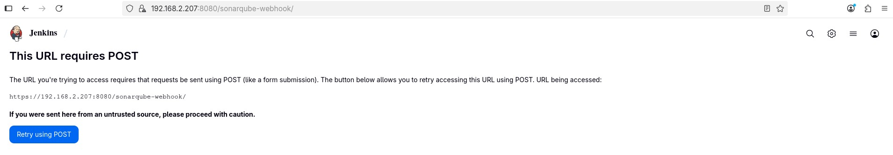
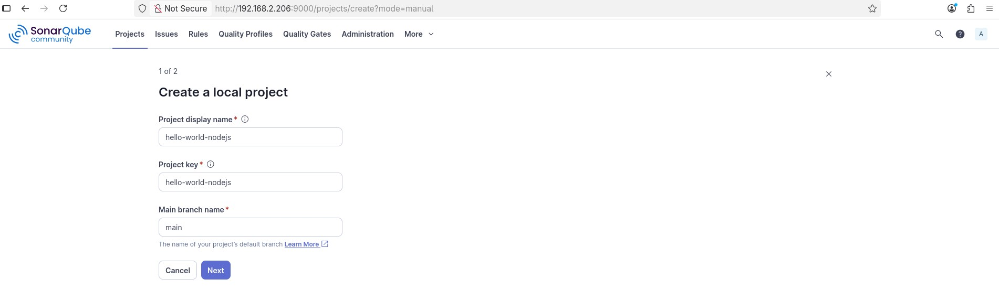

# Hello World Node.js Application

A simple "Hello, World!" application built with Node.js and Express. This project is containerized with Docker, includes deployment manifests for Kubernetes, and is configured for a CI/CD pipeline.

## Features

-   **API**: Simple HTTP server using Express.js with a health check endpoint.
-   **Testing**: Comprehensive test suite using Jest and Supertest, with code coverage reports.
-   **Development**: Local development with auto-reload via Nodemon.
-   **Containerization**:
    -   Optimized, multi-stage production `Dockerfile` using a non-root user for security.
    -   `Dockerfile.dev` for a consistent development and testing environment.
-   **Orchestration**: Production-ready Kubernetes deployment and service manifests with health checks and resource limits.
-   **CI/CD**: Ready for automation with tools like Jenkins or GitHub Actions for testing, building, and deploying.
-   **Code Quality**: Configured for integration with SonarQube.

## Prerequisites

-   Node.js (v18 or later)
-   Docker
-   kubectl (for Kubernetes deployment)

## Getting Started

### 1. Clone the Repository

```bash
git clone <repository-url>
cd hello-world-nodejs
```

### 2. Install Dependencies

```bash
npm install
```

### 3. Run the Application Locally

-   **Development Mode (with auto-reload):**
    ```bash
    npm run dev
    ```

-   **Production Mode:**
    ```bash
    npm start
    ```

The server will be available at `http://localhost:3000`.

### 4. Run Tests

```bash
# Run all tests once and generate coverage
npm test

# Run tests in watch mode
npm run test:watch
```

## Implement Jenkins Pipeline

Create jenkinsfile and create a pipepline 

<image>
<image>


## Integrate SonarQube into the Jenkins Pipeline

<login image>


Install sonarqube plugin inside Jenkins master.




Login into the Sonarqube and then create a local project and integrate it with Jenkins




Here is the line I have added on the Jenkinsfile related to sonarqube intergration into the jenkinsfile.

```
    stage('SAST - SonarQube') {
        steps {
            sh 'echo $SONAR_SCANNER_HOME'
            sh '''
                $SONAR_SCANNER_HOME/bin/sonar-scanner \
                  -Dsonar.host.url=http://192.168.2.206:9000 \
                  -Dsonar.token=sqp_fabd16be54526ef3c3be68c2a67186ceff4fa5ba \
                  -Dsonar.projectKey=hello-world-nodejs
            '''
        }
    }
```


## Docker Usage

The project includes two Dockerfiles:
-   `Dockerfile`: For creating a lean, optimized production image.
-   `Dockerfile.dev`: For creating a development environment with all dependencies needed for testing.

### Build Images

-   **Production Image:**
    ```bash
    docker build -t hello-world-app .
    ```

-   **Development Image:**
    ```bash
    docker build -f Dockerfile.dev -t hello-world-app:dev .
    ```

### Run Containers

-   **Run the Production Container:**
    ```bash
    docker run -p 3000:3000 --rm hello-world-app
    ```

-   **Run Tests in the Development Container:**
    This ensures tests are run in an environment identical to the CI pipeline.
    ```bash
    docker run --rm hello-world-app:dev npm test
    ```

## Kubernetes Deployment

1.  **Build and Push Image to a Registry**

    First, build the production image and push it to a container registry (e.g., Docker Hub, GCR, ECR).

    ```bash
    # Tag the image with your registry's path
    docker tag hello-world-app your-registry/hello-world-app:latest

    # Push the image
    docker push your-registry/hello-world-app:latest
    ```
    *Note: For multi-architecture builds (e.g., `linux/amd64`, `linux/arm64`), use `docker buildx`.*

2.  **Update Manifest**

    In `k8s-deployment.yaml`, change the `spec.template.spec.containers[0].image` field to point to the image you just pushed.

3.  **Deploy to Cluster**

    Apply the Kubernetes manifests to your cluster.
    ```bash
    kubectl apply -f k8s-deployment.yaml
    ```

4.  **Verify Deployment**

    ```bash
    # Check the status of your deployment, pods, and service
    kubectl get deployment,pod,svc

    # Get the external IP (if using a LoadBalancer service)
    kubectl get service hello-world-service
    ```

## API Endpoints

-   `GET /` - Returns "Hello, World! version1"
-   `GET /api/health` - Returns server health status as JSON.

## Security Features

-   **Non-root User**: Containers run with a dedicated, non-root user.
-   **Minimal Base Image**: Uses Node.js Alpine for a smaller attack surface.
-   **`.dockerignore`**: Prevents sensitive files and unnecessary build context from being included in the image.
-   **Dependency Separation**: Production images do not include development dependencies.
-   **Resource Limits**: Kubernetes manifests include CPU and memory limits to prevent resource exhaustion.

## File Structure

```
.
├── .github/workflows/     # CI/CD pipeline configuration (e.g., GitHub Actions)
├── k8s-deployment.yaml    # Kubernetes deployment manifests
├── tests/                 # Test files
│   └── server.test.js     # Application tests
├── .dockerignore          # Docker build exclusions
├── Dockerfile             # Production container configuration
├── Dockerfile.dev         # Development container configuration
├── jest.config.js         # Jest testing configuration
├── package.json           # NPM configuration and dependencies
├── README.md              # This file
└── server.js              # Main application file
```

## Environment Variables

-   `NODE_ENV`: Sets the environment (`development` or `production`).
-   `PORT`: Defines the server port (defaults to `3000`).

## Contributing

1.  Fork the repository.
2.  Create a new feature branch (`git checkout -b feature/my-new-feature`).
3.  Make your changes.
4.  Run tests to ensure everything still works (`npm test`).
5.  Commit your changes (`git commit -am 'Add some feature'`).
6.  Push to the branch (`git push origin feature/my-new-feature`).
7.  Submit a pull request.